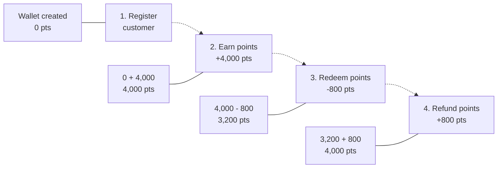

# Loyalty Management System

A Spring Boot–based loyalty management system for handling customer registration and points transactions — earn, redeem, and refund — with structured logging for observability.

## Overview

This project implements a realistic loyalty points system used to demonstrate application logging and observability patterns (see the companion blog series on [CodeOps Trek](https://codeopstrek.com)).

The core transaction flow:



## Features

- Customer registration and profile management (CRUD)
- Activate / deactivate customer accounts
- Earn, redeem, and refund loyalty points
- Duplicate and invalid-state protection (e.g. duplicate email, duplicate refund, insufficient points)
- Structured, request-traceable logging (request ID, transaction type) for every operation

## Tech Stack

- Java / Spring Boot
- Spring Data JPA
- Relational database (MySQL / PostgreSQL)
- Maven

## API Endpoints

### Customer APIs

| Method | Endpoint | Description |
|---|---|---|
| POST | `/customers` | Create a new customer |
| GET | `/customers/{id}` | Get a customer by ID |
| GET | `/customers` | Get all customers |
| PUT | `/customers/{id}` | Update a customer |
| DELETE | `/customers/{id}` | Delete a customer |
| PATCH | `/customers/{id}/activate` | Activate a customer |
| PATCH | `/customers/{id}/deactivate` | Deactivate a customer |

### Transaction APIs

| Method | Endpoint | Description |
|---|---|---|
| POST | `/transactions/earn` | Earn points |
| POST | `/transactions/redeem` | Redeem points |
| POST | `/transactions/refund` | Refund a redemption |
| GET | `/transactions` | Get transaction history |

## Project Structure

```
src/main/java/com/loyalty/loyaltyprogram
├── LoyaltyProgramApplication.java
├── controller
│   ├── CustomerController.java
│   └── TransactionController.java
├── dto
│   ├── request
│   │   ├── AddPointsRequestDto.java
│   │   ├── CustomerRequestDto.java
│   │   ├── RedeemRequestDto.java
│   │   └── RefundRequestDto.java
│   └── response
│       └── ApiResponse.java
├── enums
│   ├── AccountStatus.java
│   ├── TransactionStatus.java
│   └── TransactionType.java
├── exception
│   ├── CustomerAccountDeactivatedException.java
│   ├── CustomerNotFoundException.java
│   ├── DuplicateResourceException.java
│   ├── GlobalExceptionHandler.java
│   ├── PointsNotAvailableException.java
│   └── TransactionNotFoundException.java
├── model
│   ├── Customer.java
│   └── Transaction.java
├── repository
│   ├── CustomerRepository.java
│   └── TransactionRepository.java
└── service
    ├── CustomerService.java
    ├── TransactionService.java
    └── impl
        ├── CustomerServiceImpl.java
        └── TransactionServiceImpl.java
```

## Getting Started

### Prerequisites

- Java 17+
- Maven
- MySQL / PostgreSQL (or update `application.properties` for your DB)

### Run locally

```bash
git clone https://github.com/<your-username>/loyalty-management-system.git
cd loyalty-management-system
mvn spring-boot:run
```

The API will be available at `http://localhost:8081`.

### Postman Collection

A Postman collection with all endpoints and example requests is available [here](#) — replace with your actual collection link.

## Logging & Observability

Every request is logged with a unique `requestId` and `txnType` (e.g. `EARNED`, `REDEEM`, `REFUND`) to make tracing a single transaction across logs straightforward — this is the foundation used in the companion ELK Stack integration post to demonstrate centralized log management with Elasticsearch, Logstash, and Kibana.

## License

MIT
